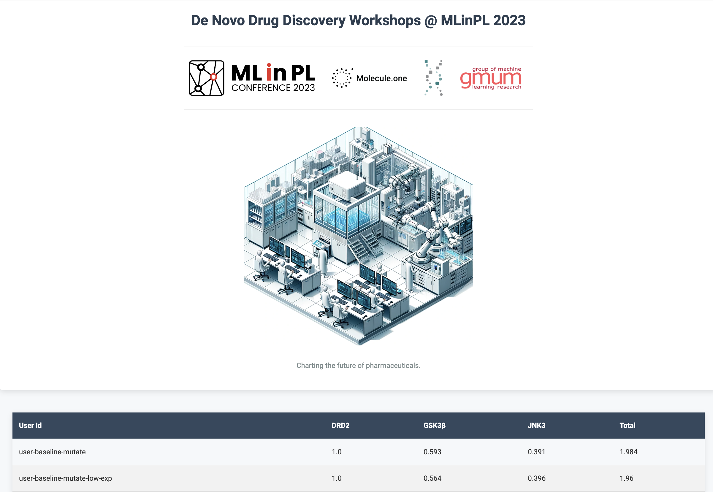

# Generative drug discovery: a practical introduction

Code support workshops run at the MLinPL 2023 conference. The workshops are centered around submitting
compounds to a leaderboard using various strategies.

## Features

1. Leaderboad with server for scoring compounds for three proteins (DRD2, GSK3b, JNK)

2. Three strategies to generate compounds: random exploration, mutation based, machine learning based

## Components

1. [Exercise notebook](notebooks/MLinPL_23_Workshops.ipynb): exercises for workshop.

2. [Server README.md](server/README.MD): information on using the server behind

3. [Solution implementation](solutions): implementation of solutions